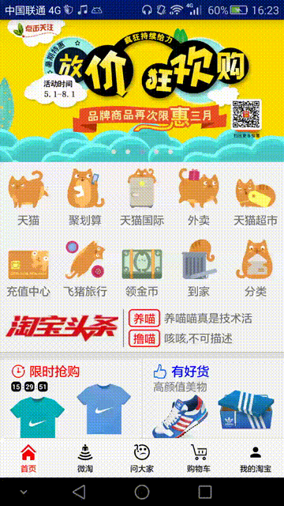

# First Page of Taobao Android Mobile App by ReactNative

## Demo
 

## How to run
1. Prepare your environment: [Requirements](http://facebook.github.io/react-native/docs/getting-started.html#requirements) and [Android Setup](http://facebook.github.io/react-native/docs/android-setup.html)
2. Clone this repo, and goto the project root directory
3. Run `npm install`
4. Run `react-native run-android`
5. Enjoy

## Platform & ReactNative version
Currently there's only Android implementation. So index.ios.js & ./ios are absent. 
React version of this demo is 15.4.1. ReactNative version of this demo is 0.41.2.

## Insight & Pitfalls

### ViewPager's implementation
ReactNative provides [ViewPagerAndroid](https://facebook.github.io/react-native/docs/viewpagerandroid.html) as a component to fullfill similar function of native `ViewPager`. In fact it just wraps `ReactViewPager`. The drawback of simply using `ViewPagerAndroid` is lack of flexibility: e.g., it's impossible to slide the content in vertical direction. Inspired by [race604/react-native-viewpager](https://github.com/race604/react-native-viewpager), the viewpager in this demo enhances it, adds more flexibility such as control of slide direction, pager indicator style & position, etc. In this demo, there are both horizontal & vertical sliding viewpagers.

Related code: [CustomViewPager.js](./view/CustomViewPager.js).

### PullToRefresh's implementation
At first the demo tries to implement a pull-to-refresh-scrollview in pure js, using [ScrollView](https://facebook.github.io/react-native/docs/scrollview.html), [PanResponder](https://facebook.github.io/react-native/docs/panresponder.html) and [Animated](https://facebook.github.io/react-native/docs/animated.html). Basic idea is to concatenate a loading layout and a `ScrollView`: when loading layout is hidden, `ScrollView` is receiving gestures. When loading layout is pulled out to show, panresponder is receiving gestures, so scrollview receives no gesture, and loading layout is pulled out using `Animation`. However, this idea encounters a gesture processing problem : [react-native/issues/1046](https://github.com/facebook/react-native/issues/1046), which indicates:
> Ideally, once something gets the responder, it can prevent others from responding by setting onPanResponderTerminationRequest: () => false,

> However, we often have troubles while interacting with touch interactions happening on the main thread, like the iOS slider, or any scroll views. The problem is that javascript cannot immediately reject the responsiveness of the native event, because the main thread must synchronously decide if JS or the scroll view should become responder, and JS can only respond asynchronously.

> This is a difficult problem to solve, and is something we have been thinking about for a while. cc @vjeux @sahrens @jordwalke @lelandrichardson. This could be solved in a similar way as @kmagiera is moving animations to the UI thread. Basically we construct and serialize some logic such that these immediate operations can be resolved without waiting for the JS thread.

Due to this issue, and the fact that ReactNative `ScrollView` wraps a native `ReactScrollView`, `PanResponder` can not totally block gestures from passing to the native scrollview. As a result, sometimes when we try to pull down to refresh, gestures are absorbed by native scrollview to show an overscroll effect, not the pulldown of loading layout.

To solve this problem, the demo processes gestures in native code, then export the native view to ReactNative's js realm. Based on widely-known [chrisbanes/Android-PullToRefresh](https://github.com/chrisbanes/Android-PullToRefresh), the demo simplifies its code, deleting unnecessary mode & attribute, retaining just the gesture processing part: [RCTPullToRefreshScrollView.java](./android/app/src/main/java/com/rntaobao/pullToRefresh/view/RCTPullToRefreshScrollView.java). Then the demo exports it to js realm by [RCTPullToRefreshScrollViewManager.java](./android/app/src/main/java/com/rntaobao/pullToRefresh/viewManager/RCTPullToRefreshScrollViewManager.java), the js component is [PullToRefreshScrollView.js](./view/PullToRefreshScrollView.js).

Another problem is how to define loading layout in js, not in java. This offers flexibility to hot reload the UI of loading layout. Intuitively, the demo tries to pass js element to native view by [Props](https://facebook.github.io/react-native/docs/props.html). But this doesn't work since [Native UI Components](https://facebook.github.io/react-native/docs/native-components-android.html) only imports props of primitive types, or simple data structure such as `ReadableArray` & `ReadableMap`. 

To hack this, the demo defines a native [RCTPullToRefreshLoadingLayout.java](./android/app/src/main/java/com/rntaobao/pullToRefresh/view/RCTPullToRefreshLoadingLayout.java), exports it to js by [RCTPullToRefreshLoadingLayoutManager.java](./android/app/src/main/java/com/rntaobao/pullToRefresh/viewManager/RCTPullToRefreshLoadingLayoutManager.java), the js component is [PullToRefreshLoadingLayout.js](./view/PullToRefreshLoadingLayout.js). When the js component of this view, `<RCTPullToRefreshLoadingLayout>` is added as a child of `<RCTPullToRefreshScrollView>`, on the java side, `RCTPullToRefreshLoadingLayout` is also added as a child of `RCTPullToRefreshScrollView`. Override the `addView` method of `RCTPullToRefreshScrollView` to search for instance of `RCTPullToRefreshLoadingLayout`. Once found, the demo gets the reference to it, i.e. the loading layout defined in js. With this reference, further manipulation with the loading layout is possible on java side.

Notably, to support the negative padding necessary for the pull down effect, `RCTPullToRefreshScrollView` should handle its own layout, rather than leaving it to js. This is made possible by:
```java
    @Override
    public boolean needsCustomLayoutForChildren() {
        return true;
    }
```
in `RCTPullToRefreshScrollViewManager`.

### CircleProgressBar's implementation

The circle progress bar in loading layout, is drawn by [react-native-svg](https://www.npmjs.com/package/react-native-svg) and [d3-shape](https://www.npmjs.com/package/d3-shape). The idea comes from [fdnhkj/react-native-conical-gradient](https://github.com/fdnhkj/react-native-conical-gradient). Related code: [CircularProgressBarSvg.js](./view/CircularProgressBarSvg.js).

The demo also provides a `ART` version of circle progress bar. Sadly `ART` has NO official documentation: [react-native/issues/4789](https://github.com/facebook/react-native/issues/4789), and it frequently crashes (reason still not known). Related code: [CircularProgressBarART.js](./view/CircularProgressBarART.js).

### TabNavigation's implementation
TabNavigation is supported by [react-native-tab-navigator](https://www.npmjs.com/package/react-native-tab-navigator). One thing to mention is that the `SceneContainer` of this lib uses a style of `position: absolute`, making the scene content actually takes up the whole space of its parent view. For this demo, the `SceneContainer` is set to fixed height, which is the screen height minus tabBar height.

